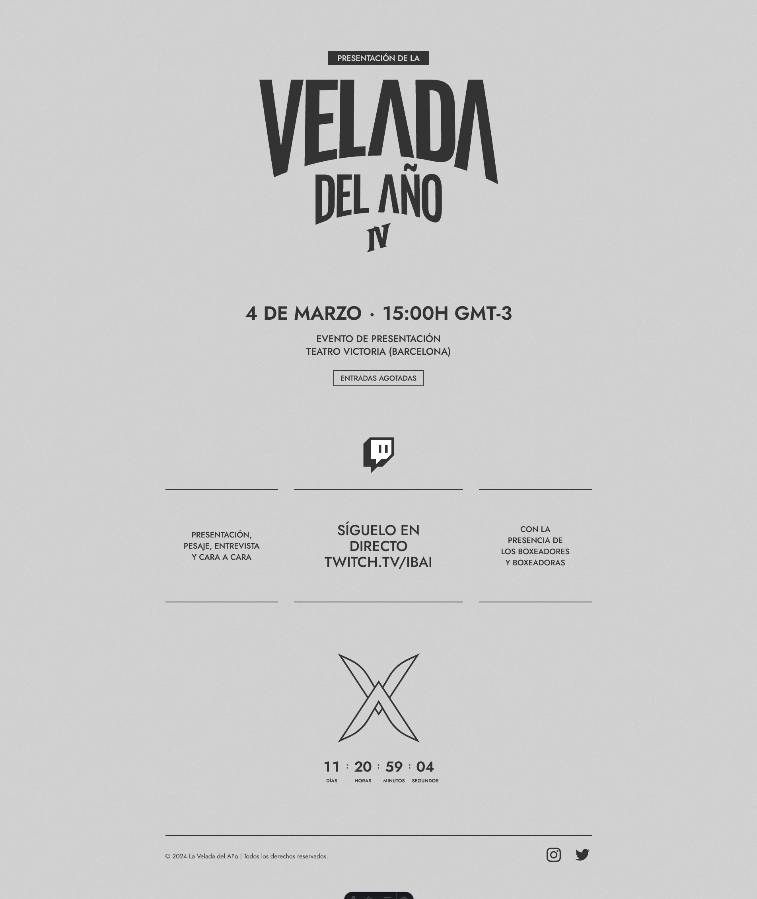

<h3 align="center">Bienvenidos a</h3>

# Proyecto oficial de código abierto

## Descripción
La Velada IV es una competición de boxeo que enfrenta a Streamers, Creadores de Contenido y otras Celebridades sobre un ring.

## Características Principales
- **Detalles del Evento:** Obtén información detallada sobre la fecha, hora, ubicación y artistas participantes.
- **Compra de Boletos:** Permite a los usuarios dirigirlos a la compra de boletos fácilmente.
- **Redes Sociales:** Conoce las redes oficiales donde podrás informarte sobre el evento.

## Capturas de Pantalla
 

## Contribuir
¡Contribuciones son bienvenidas! Si encuentras errores o tienes sugerencias de mejora, por favor abre un issue o envía un pull request.

## 🛠️ Stack

- [**Astro**](https://astro.build/) - The web framework for content-driven websites.
- [**Typescript**](https://www.typescriptlang.org/) - JavaScript with syntax for types.
- [**Tailwind CSS**](https://tailwindcss.com/) - A utility-first CSS framework for rapidly building custom designs.
- [**@midudev/tailwind-animations**](https://tailwindcss-animations.vercel.app) - Easy peasy animations for your Tailwind project.

## 👑 Contribuidores

